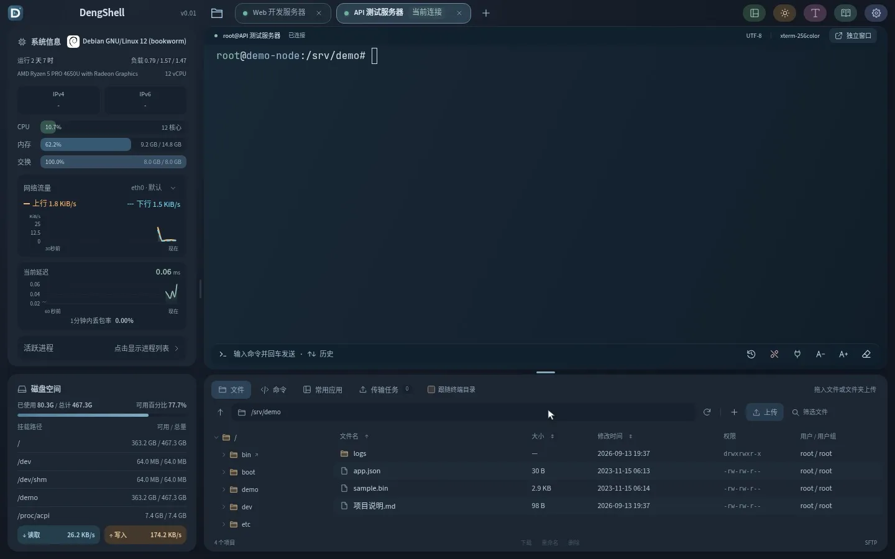
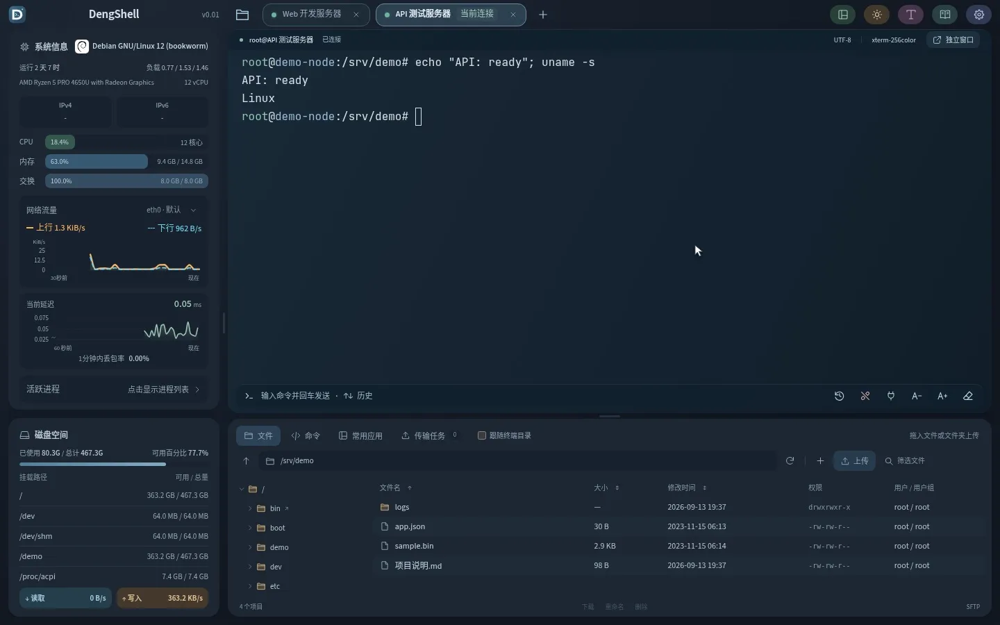
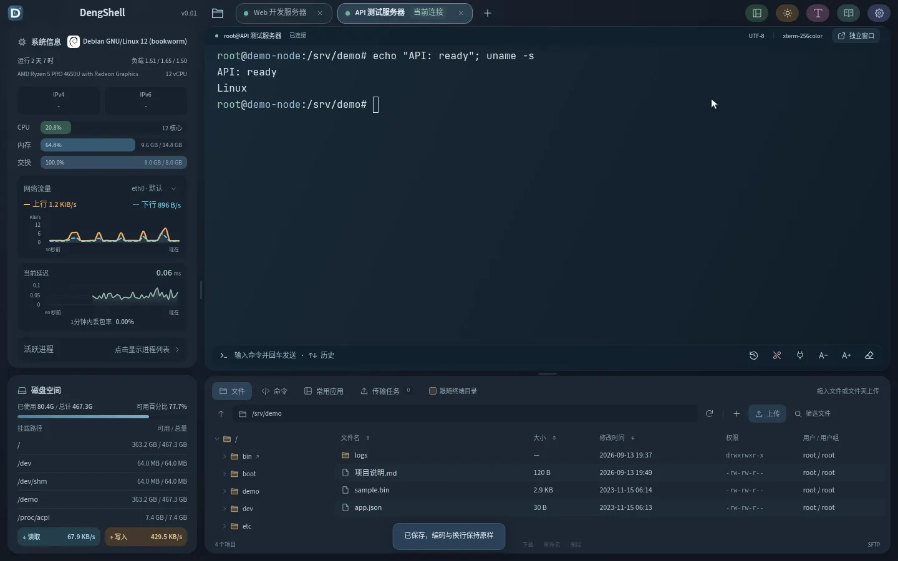
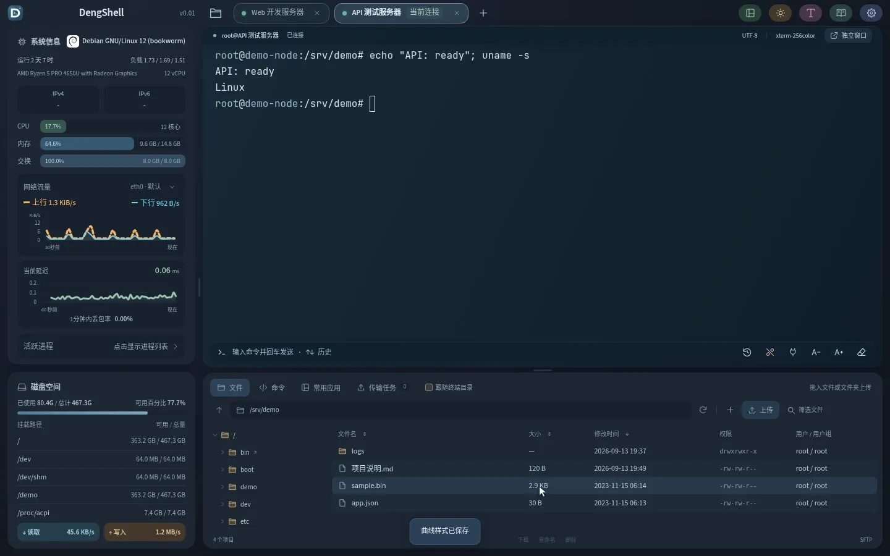

# DengShell

**把 SSH 终端、远程文件、服务器监控和常用命令放在一个窗口里。**

DengShell 是一款中文界面的开源 SSH 桌面工具，适合日常管理 VPS、维护 Linux 服务器、编辑远程配置和排查网络问题。支持 Windows 与 Linux 桌面，可同时连接多台服务器，并按自己的习惯调整字体、背景、布局和监控曲线。

本说明对应 **v0.01 r26**。从 R20 升级的全部变化一次汇总在 [更新日志](CHANGELOG.md)。

## 内容导航

- [功能概览](#功能概览)
- [下载与安装](#下载与安装)
- [第一次连接服务器](#第一次连接服务器)
- [服务器与连接管理](#服务器与连接管理)
- [SSH 终端与多窗口](#ssh-终端与多窗口)
- [命令历史与快捷命令](#命令历史与快捷命令)
- [SFTP 文件管理与编辑](#sftp-文件管理与编辑)
- [服务器状态与网络诊断](#服务器状态与网络诊断)
- [字体主题与布局](#字体主题与布局)
- [常用应用](#常用应用)
- [配置备份与升级](#配置备份与升级)
- [常用快捷操作](#常用快捷操作)
- [常见问题](#常见问题)
- [开源许可](#开源许可)

## 功能概览

| 功能 | 可以做什么 |
| --- | --- |
| 服务器管理 | 多级分组、名称与地址搜索、表情和国旗图标、批量连接、历史连接、已删除连接恢复 |
| SSH 认证 | 密码、私钥、加密私钥、SSH Agent，首次连接核对主机指纹 |
| 密钥管理器 | 导入与生成密钥、复制公钥、查看指纹、统一保存私钥口令 |
| 代理管理器 | 保存 SOCKS5 / HTTP CONNECT 代理，为各条连接选择代理 |
| 多会话终端 | 标签切换、断开与重连、会话拆分为独立窗口、窗口之间合并标签 |
| 命令管理 | 汇总各台 VPS 的命令历史、搜索与复制、再次执行、彩色分组快捷命令 |
| SFTP 文件管理 | 上传与下载、目录上传、传输队列、重命名、权限修改、打包下载 |
| 文件查看与编辑 | 显示实际用户和用户组名称，按大小及修改时间排序，内置多编码文本编辑器 |
| 服务器监控 | 系统信息、CPU、内存、SWAP、负载、进程、网卡流量、磁盘容量与读写速度 |
| 网络诊断 | ICMP 延迟与丢包曲线、本机及远端 MTR、可用的路由 ASN 信息 |
| 个性化 | 明暗主题、跟随系统、20 款内置终端字体、字体导入、背景导入、布局与缩放 |
| 曲线设置 | 分别保存上行、下行的线型、粗细和颜色，以及延迟曲线的粗细和颜色 |
| 日常维护 | BBR 参数方案、指定范围的缓存清理、第三方测试入口、SWAP 管理 |
| 本地数据 | 加密配置、便携目录、整目录备份与迁移 |

下文四段动态图均来自实际界面操作，使用隔离的 SSH / SFTP 演示环境录制，帧率为 **15 FPS**。这些核心功能演示录制于 R20，新增功能以本版文字说明为准。

## 下载与安装

在本仓库的 **[Releases](https://github.com/BitsFlowCloud/DengShell/releases)** 页面选择适合自己系统的文件。安装好的程序无需另外安装 Go 或 Node.js。

| 平台与用途 | 下载文件 | 使用方式 |
| --- | --- | --- |
| Windows 10 / 11 x64 安装版 | `DengShell-Setup-x64.exe` | 运行安装器，从开始菜单或桌面启动，可通过控制面板卸载 |
| Windows x64 绿色版 | `DengShell-windows-x64.zip` | 解压后运行 `DengShell.exe`，配置保存在旁边的 `data/` |
| Debian / Ubuntu x86-64 | `DengShell-linux-x64.deb` | 使用系统包管理器安装 |
| Fedora / openSUSE x86-64 | `DengShell-linux-x64.rpm` | 使用对应发行版的包管理器安装 |
| Arch Linux / 兼容 pacman 的 x86-64 桌面 | `DengShell-linux-x64.pkg.tar.zst` | 使用 `sudo pacman -U` 安装 |
| 其他满足依赖的 Linux x86-64 桌面 | `DengShell-linux-x64.tar.gz` | 解压运行，或安装到当前用户的应用菜单 |

Windows 版本需要 Microsoft Edge WebView2，缺少时程序会提供安装指引。安装版默认安装到当前用户目录，卸载保留个人配置。

Linux 版本使用 GTK3 和 WebKitGTK 4.1，发行构建以 Ubuntu 22.04 / glibc 2.35 为基线。当前包不适用于 ARM、32 位、Alpine/musl 或缺少对应运行库的系统。

**测试情况：**

- **Linux：已测试通过。** 已在 Ubuntu 22.04、Ubuntu 24.04、Debian 12、Fedora 43 和 openSUSE Tumbleweed 和 Arch Linux 容器中通过安装、原生界面启动及卸载保留配置测试。具体范围见 [功能审查与验证](build/FUNCTIONAL-AUDIT-r26.md)。
- **Windows：此前版本用户实机使用正常；本次 R26 已通过构建、压缩及安装包静态检查，尚未做 Windows 实机安装／卸载回归。**

### Linux 安装示例

Debian / Ubuntu：

```bash
sudo apt install ./DengShell-linux-x64.deb
```

Fedora：

```bash
sudo dnf install ./DengShell-linux-x64.rpm
```

openSUSE：

```bash
sudo zypper install ./DengShell-linux-x64.rpm
```

Arch Linux：

```bash
sudo pacman -U ./DengShell-linux-x64.pkg.tar.zst
```

通用包：

```bash
tar -xzf DengShell-linux-x64.tar.gz
cd DengShell-linux-x64
bash data/support/start.sh
```

需要加入当前用户的应用菜单时，在解压后的目录执行：

```bash
bash data/support/install.sh
```

各发行版的依赖和数据目录说明见 [Linux 使用说明](build/linux/README.txt)。

## 从 FinalShell 导入

在 FinalShell 导出当前或全部 SSH 连接，将 JSON 放入名为 `finalshell_oot_pot` 的文件夹，再放到 DengShell 程序旁。点击 **设置 → 从 FinalShell 导入**，自动扫描并导入。密码会自动解析并加密保存，无需安装 Python 插件；密钥记录若只有引用，点击“补充私钥”关联密钥。重复导入保留已有连接和手动修改。详见 [导入说明](build/FINALSHELL-IMPORT.md)。

## 第一次连接服务器

1. 打开 DengShell，点击顶部的文件夹图标，进入 **服务器管理**。
2. 选择 **新建连接**，填写名称、服务器地址、SSH 端口和用户名。
3. 选择密码、私钥或 SSH Agent 认证，按需要设置所属分组和连接代理。
4. 点击 **保存并连接**。
5. 首次连接时，通过服务器控制台等可信渠道核对主机指纹，确认一致后选择 **已核实，信任并连接**。
6. 连接就绪后，在终端执行命令，或使用文件面板管理远程文件。

需要再次查看帮助时，点击顶部的书本图标。内置手册支持搜索、章节跳转和重新查看首次引导。

## 服务器与连接管理

### 多级分组与搜索

- 按地区、服务商、项目或用途创建分组，也可以继续创建子分组。
- 为分组选择表情或国旗图标，支持按名称和关键词搜索图标。
- 按连接名称、地址、用户名或分组路径查找服务器。
- 分组支持展开与收起，并保留状态。
- 排序支持中文拼音和自然数字顺序，例如编号 `2` 排在 `10` 前面。
- 按住 `Ctrl` 单击服务器进行多选，点击 **打开所选** 或按 `Enter` 发起批量连接。

批量连接时，各台服务器独立连接、独立显示进度。连接失败的标签会保留原因，可单独重试；连接完成后不会抢走正在使用的标签焦点。

### 历史连接与回收区

**历史连接**记录成功连接时间和累计次数，便于找到最近使用的服务器。

删除连接后，配置先进入 **已删除**，可以恢复原连接、分组和已保存的认证信息。永久删除需要在回收区再次操作。这里管理的是本机保存的连接资料，远程服务器本身保持原状。

### 密钥管理器

在 **设置 → 密钥管理器** 中，可以导入私钥、生成 Ed25519 密钥、命名密钥、查看指纹和复制公钥。同一把密钥可以绑定多台服务器。

**在密钥管理器中填入并保存私钥口令后，所有引用这把密钥的 SSH 连接都会自动使用该口令，重启 DengShell 后仍然有效。** 旧版已导入的密钥可以通过编辑补填口令。

生成密钥后，需要把公钥配置到远程账号的 `authorized_keys` 中。直接填写外部私钥路径时，口令由该连接的设置管理，文件路径也需要自行保留。

SSH Agent 认证使用本机已配置的 Agent；Agent 的启动与密钥加载由本机环境负责。服务器额外要求的账户密码或多因素验证，仍按服务器的认证要求处理。

### 连接代理

在 **设置 → 代理管理器** 保存 SOCKS5 或 HTTP CONNECT 代理，可填写名称、地址、端口及可选的认证信息。每条 SSH 连接可以选择直连、已保存的代理或自定义代理。

代理设置在重新连接后生效。直连遵循本机路由，因此本机启用的 TUN 也可能影响连接路径。

## SSH 终端与多窗口

每个 SSH 会话使用独立标签，选中的已连接标签旁显示 **当前连接**。终端支持交互式 Shell、命令行编辑器及常见终端程序。

- **断开**：保留当前标签与滚屏内容，方便查看之前的输出。
- **重新连接**：为该服务器重新建立 SSH 会话。
- **清除滚屏**：清理本地显示内容，已执行的远程命令不受影响。
- **调整字号**：使用 `A−`、`A+` 或字号输入框调整终端文字大小。
- **独立窗口**：通过标签右键菜单或拖出标签栏，将已连接会话移入新窗口。
- **合并窗口**：把标签移入同一次启动、共享后台的另一个 DengShell 窗口，也可通过标签右键菜单选择目标。

会话在窗口间移动时保留原 SSH 连接、远程 PTY、当前目录、运行中的程序及终端内容。当前窗口至少有两个 SSH 标签时，工具栏会显示 **独立窗口** 按钮。

Windows 和 Linux X11 支持拖动标签到其他窗口；Wayland 下使用合并菜单。若有待处理的上传任务，按界面提示完成后再移动会话。

## 命令历史与快捷命令



### 汇总所有 VPS 的命令

在 DengShell 的各个 VPS 会话中实际提交的命令，会汇总保存到**本机的历史列表**中。例如先在 VPS A 执行 `uptime`，再在 VPS B 执行 `df -h`，打开历史列表即可查找这两条命令。

远端各台 VPS 的 Shell 历史保持独立。DengShell 收集的是通过自身会话提交的命令，其他 SSH 客户端里的操作不在采集范围内。

- 切换服务器后仍可查看完整列表，未连接时也能查看和复制。
- 支持关键词搜索、复制、填入命令输入条和再次执行。
- 点击命令正文先填入输入条，便于修改；点击 **执行** 会发送到历史弹窗显示的 **执行目标** 会话。
- 最多保留最近 **2000 条**，总量上限 **2 MiB**；连续相同的记录会合并。
- 密码提示、尚未提交的文字以及终端程序内部输入不作为命令记录。

完整采集依赖兼容的 Shell 集成，Bash / Zsh 为主要适配对象；其他 Shell 的采集范围可能受限。终端输入条的 `↑` / `↓` 仍浏览当前服务器的历史，历史弹窗用于查看所有服务器的汇总。

### 多行输入与快捷命令

终端底部的命令输入条支持先编辑再发送：`Enter` 执行，`Shift + Enter` 换行。

在下方面板的 **命令** 页签，可以把常用操作保存为彩色胶囊按钮。每条命令支持名称、颜色、分组和多行内容；命令区域右键可新建分组，空分组也会保存。

每条命令独立保存 **末尾添加回车 CR**：默认不勾选，仅填入终端；勾选后发送并执行。旧命令缺少此选项时也采用不自动回车。右键命令可编辑、删除或选择“调用前编辑”，按钮旁不再常驻编辑图标。

拖动命令或命令分组可调整顺序，拖到其他分组可移动命令。排序会保存，空分组也保留。

编辑命令时可插入 1–5 号参数，例如 `docker logs [p#1 容器] --tail [p#2 行数]`。调用后在 **命令编辑区** 填写参数、检查实际命令预览，再发送；参数和长命令草稿在本次运行中保留，便于多次调整。发送目标单独显示，切换服务器标签不会改变它。终端输入条旁的编辑按钮也可展开编辑区。详见 [命令与编辑器说明](build/COMMANDS-AND-EDITORS.md)。

## SFTP 文件管理与编辑



### 文件浏览与排序

文件面板左侧显示目录树，右侧显示目录内容，两部分可以独立滚动。可以通过路径栏跳转目录、返回上级、刷新，或按名称过滤当前目录。

- **用户与用户组显示实际名称**，例如 `root`；无法解析时显示未知状态。
- 点击 **文件名**、**大小**、**修改时间**表头切换排序方向，箭头标明升序或降序。
- 大小按实际字节数排序，修改时间按实际时间排序，文件夹保持在文件前面。
- 启用 **跟随终端** 后，在支持目录报告的 Shell 中，文件面板可随终端目录变化。

### 上传、下载与传输任务

将本机文件或目录拖入文件面板即可上传，也可以从上传菜单选择文件或文件夹。传输任务页签显示进度、结果和失败原因，支持取消与重试。

上传最多同时处理 **4 个文件**，其余自动排队；单个文件可并行传输多个 SFTP 分块。进度按服务器已确认写入的数据计算。重试从头开始，当前不支持断点续传。

右键文件或目录可以打开、重命名、删除、快速删除、复制路径、修改权限或打包下载。打包操作通过 SFTP 读取内容，在本机生成压缩包。文件区的 **＋** 按钮及空白处右键菜单提供新建文件和文件夹入口。

删除与快速删除都会先显示目标服务器和完整路径；远程文件删除后，无法从连接管理器的回收区恢复。

### 内置文本编辑器

双击文本文件，或右键选择 **打开**，即可在内置编辑器中修改并保存到服务器。

多个文件各有独立标签，显示所属服务器、文件名、未保存标记和 **当前查看**；可以同时打开不同服务器的文件。点击“移到新窗口”拆分为应用内可拖动编辑窗口，每个窗口具有自己的标签栏，也可合并回其他编辑窗口。

每个文件分别保留内容、编码、光标与撤销记录，保存始终指向原服务器和路径。关闭未保存文件会提示；原连接断开后保留草稿供复制，不会改存到当前其他连接。收起窗口后点击文件工具栏“文本编辑器”恢复。

| 项目 | 支持情况 |
| --- | --- |
| 编码 | UTF-8、带 BOM 的 UTF-8 / UTF-16、GB18030、GBK、Big5 |
| 文件大小 | 单文件最大 8 MiB |
| 文本格式 | 保留原有编码、BOM、空格与换行形式 |
| 编辑操作 | 保存、撤销、复制全文，`Ctrl + S` 保存到服务器 |
| 修改冲突 | 保存前检查远程文件是否变化，发现冲突时停止覆盖 |
| 保存方式 | 使用临时文件替换，保留基本权限与所有者；不支持相应操作时显示原因 |

无法明确识别编码时，需要手动选择；所选编码无法表示的字符会阻止保存。对依赖 ACL、扩展属性或硬链接身份的特殊文件，应使用能保留这些属性的系统编辑工具。

也可以选择系统关联程序或自定义编辑器打开下载到本机的副本。外部编辑后的内容需要手动上传。

## 服务器状态与网络诊断

### 系统、进程与磁盘

连接后可查看远端发行版名称与图标、运行时间、CPU、内存、SWAP、系统负载、磁盘挂载点、容量及读写速度。

展开 **活动进程** 可查看进程信息，按 CPU、内存或命令排序。进程列表只在展开且窗口可见时按需采集；收起后保留最近一次结果。

监控主要面向 Linux 服务器，数据取决于远端系统接口和账号权限。尚未取得有效数据时显示 `—`。

### 上行与下行流量

每条已连接的 SSH 会话独立采集网卡流量，约每 **1 秒**读取一次，显示最近 **30 秒**的曲线。切换标签或最小化后，已连接会话的网络历史仍在后台记录。

CPU、内存、负载与磁盘速率约每 **5 秒**按可见状态更新，网卡信息和磁盘容量约每 **30 秒**刷新。

上行表示服务器发送数据，下行表示服务器接收数据。读数使用 `B/s`、`KiB/s`、`MiB/s`、`GiB/s`，按 1024 进位，并随近期数据自动调整纵轴范围。采样失败会保留缺口。

支持选择网卡，查看其地址信息。公网 IPv4 / IPv6 仅在能够确认时显示；NAT 入口与服务器出口可能不同。

### 独立设置曲线样式



打开 **设置 → 曲线样式**：

| 曲线 | 可独立调整 |
| --- | --- |
| 上行网速 | 实线 / 虚线、线条粗细、颜色 |
| 下行网速 | 实线 / 虚线、线条粗细、颜色 |
| 延迟 | 线条粗细、颜色 |

线条粗细范围为 **0.5–6 px**，颜色可以自定义或跟随明暗主题。设置时可预览，每条曲线都可单独恢复默认；点击 **保存设置** 后，重启仍会保留。

### ICMP 延迟与 MTR

ICMP 面板展示本机到目标的延迟、最近 **1 分钟**丢包率和连续曲线。超时、不可达或缺测会单独标识；悬停或使用方向键可查看对应采样的读数和状态。

MTR 支持从本机探测服务器，也可从远程服务器探测指定目标，查看逐跳响应和可用的 ASN 信息。缺少工具时，会先展示安装方案，经确认后安装。

ICMP 走本机路由或 TUN，不经过应用设置的 SOCKS5 / HTTP 代理；其读数不能直接代表 SSH 代理链路或按键响应。中间路由器可能限制探测回应，需要结合后续节点与目标结果判断。

## 字体主题与布局



### 字体与文字颜色

设置 → **界面字体与文字颜色**：内置 Noto 黑体、Noto 宋体、更纱 UI、霞鹜文楷屏幕版、Maple Mono CN，包含简繁中文和英文，附 OFL 1.1 许可。内置界面字体立即生效；导入的界面字体需完整退出并重启后启用。浅色和深色界面文字颜色分别设置、保存和恢复默认。界面字体与下述终端字体独立管理。

- 内置 **20 款终端字体**，并随程序携带中文后备字体。
- 支持导入 TTF、OTF、WOFF 和 WOFF2 字体。
- 字号范围 **8–40 px**，按 **0.5 px** 调整，也可直接输入数值。
- 每款字体分别保存加粗与文字颜色，切换字体时应用对应样式。
- 配色支持预设色、RGB、HEX 和颜色选择器，窗口可拖动并实时预览。
- 提示符的用户名与主机名可以分别配色；在兼容的 Bash / Zsh / Fish 中于下一次提示符显示时生效。

自定义字体的等宽效果和符号覆盖取决于字体本身；远程程序主动设置的 ANSI 颜色会保留其含义。

### 主题、背景与窗口

- 支持浅色、深色主题，以及 **明暗跟随系统**。
- 主题切换有渐变效果，并尊重系统的减少动态效果偏好。
- 背景管理器提供内置背景，也可导入 PNG、JPG、WebP 图片并调整显示强度。
- 信息栏可以放在终端左侧或右侧，文件区可以放在上方或下方。
- 拖动分隔条调整面板宽度和高度，支持恢复默认布局。
- 界面缩放与终端字号分别调整，窗口尺寸和偏好会保存。
- 最小化可选择普通最小化或托盘，并记住选择；Linux 托盘需要桌面提供相应服务。
- 启动动画可在设置中开关。

## 常用应用

文件区的 **常用应用**提供以下入口，操作内容及结果显示在当前 SSH 终端中。

| 工具 | 作用 |
| --- | --- |
| BBR 优化 | 使用现有内核 BBR，提供保守、平衡、激进三种参数方案，应用前检查并备份 |
| 清理垃圾 | 清理明确列出的软件包缓存和早于 14 天的归档 journal 日志 |
| NQ 测试 | 查看并确认后运行第三方 NodeQuality 测试脚本 |
| YABS 测试 | 查看并确认后运行第三方 YABS 测试脚本 |
| 国际测速 | 提供第三方测速脚本入口，执行前确认脚本及流量消耗 |
| SWAP 管理 | 检查现有交换区，按支持条件创建交换文件，或关闭、删除已确认的交换文件 |

这些操作在用户确认后执行，涉及系统设置时需要远端 root 或 sudo 权限。BBR 实际效果取决于内核与网络环境；第三方脚本的内容由其维护者提供，测速可能消耗大量流量。

SWAP 支持常用容量及自定义大小，并根据文件系统和交换区类型判断可执行操作。交换分区与 zram 只关闭交换用途；重新设置时按工具提示处理重启要求。具体行为见 [常用应用说明](build/COMMON-APPS.md)。

## 配置备份与升级

### 数据保存在哪里

在 **设置 → 连接配置文档** 查看当前程序实际使用的数据目录。

| 使用方式 | 默认数据位置 |
| --- | --- |
| Windows 安装版 | 当前用户安装目录内的 `data/` |
| Windows / Linux 便携版 | 程序旁的 `data/` |
| Linux DEB、RPM、pacman 或通用安装版 | `${XDG_CONFIG_HOME:-$HOME/.config}/dengshell` |

指定 `--config` 时使用指定的数据目录，以应用显示的实际路径为准。

连接资料、保存的凭据和偏好存入本地加密配置；导入的私钥、字体和背景跟随数据目录。配置使用 AES-256-GCM，自动解锁密钥保存在同一目录，因此拥有该目录读取权限的程序仍可能取得数据。

### 如何备份与迁移

1. 退出 DengShell。
2. 备份整个实际数据目录，包括 `dengshell.config.enc`、`dengshell.config.key`、`assets/` 和 `keys/`。
3. 在目标电脑退出程序后，将备份放入它的实际数据目录，再启动。
4. 手动填写的外部私钥路径需要另行复制并检查。

加密配置与解锁密钥需要一起备份。导入管理器的字体、背景和私钥已复制到数据目录，原导入文件移动后仍可使用。

### 升级

启动时可以检查新版本，确认后下载并验证 Ed25519 发行签名、大小、SHA-256、有效期和更高构建号。Windows 和 Debian / Ubuntu 提供相应在线更新流程，RPM、Arch pacman 和通用包通过对应安装包升级。当前属于退出并重启的更新方式，不保留正在运行的 SSH 会话；GitHub 发布本身不自动部署官网的更新文件。

手动升级时先退出程序，替换程序文件或安装新版，并保留原数据目录。升级会中断当前 SSH 会话。Windows 安装版卸载保留个人数据；从便携版改用 Linux 安装版时，可按实际目录迁移备份。

## 常用快捷操作

| 场景 | 操作 | 作用 |
| --- | --- | --- |
| 终端 | `Ctrl + Shift + C` | 复制选中的终端文字 |
| 终端 | `Ctrl + Shift + V` | 粘贴到当前终端 |
| 终端 | `Ctrl + C` | 向远程程序发送中断 |
| 命令输入条 | `Enter` | 发送并执行命令 |
| 命令输入条 | `Shift + Enter` | 插入换行 |
| 命令输入条 | `↑` / `↓` | 浏览当前服务器的历史 |
| 内置文本编辑器 | `Ctrl + S` | 保存当前文件到原服务器 |
| 内置文本编辑器 | `Ctrl + Tab` / `Ctrl + Shift + Tab` | 切换本窗口文件标签 |
| 内置文本编辑器 | `Ctrl + W` | 关闭当前文件，未保存时提示 |
| 命令编辑区 | `Ctrl + Enter` | 按回车选项发送预览命令 |
| 服务器管理 | `Ctrl + 单击` | 多选或取消选择服务器 |
| 服务器管理 | `Enter` | 打开已选择的服务器 |
| 拖动会话标签 | `Esc` | 取消本次拖动 |
| 延迟图 | `←` / `→` | 聚焦图表后查看相邻采样 |

## 常见问题

**保存了私钥口令，连接时还会要求输入吗？**

从密钥管理器选择的密钥，只要口令已在管理器中保存，引用它的连接就会自动使用。若仍出现提示，先核对是否选中了同一把库内密钥，再确认提示要求的是私钥口令，还是服务器额外要求的账户密码或其他认证。

**历史列表能看到所有 VPS 的命令吗？**

能汇总在 DengShell 各会话中实际提交、且被兼容 Shell 集成采集到的命令。记录保存在本机，受最近 2000 条和 2 MiB 的上限限制；其他客户端输入的命令不会自动导入。

**文件管理器能按大小和修改时间排序吗？**

可以。点击对应表头即可切换升序、降序；排序使用实际大小和时间值。

**曲线颜色和粗细重启后还在吗？**

在 **设置 → 曲线样式** 中点击 **保存设置** 后会保留。上行与下行还可以分别选择实线或虚线。

**为什么网速或延迟有时显示缺口？**

缺口表示当时未取得有效采样，例如探测超时、连接异常或接口不可用。图表按实际结果显示，不把缺测当作零流量或零延迟。

**外部编辑器保存后，服务器文件会自动更新吗？**

外部编辑器修改的是本地副本，需要手动上传。使用内置编辑器的 **保存到服务器** 或 `Ctrl + S`，才会直接保存到远端。

**换电脑时只复制 EXE 就够了吗？**

程序可以独立启动；要带走原有连接、密钥、历史和个性化设置，还需要完整复制数据目录。

## 开源许可

DengShell 应用代码采用 [MIT License](LICENSE)，可按许可使用、修改和分发。

项目使用 Go、Wails 与 xterm.js 等组件。第三方库、字体和图标保留各自许可证；相应许可文件随源码和发行包提供。
